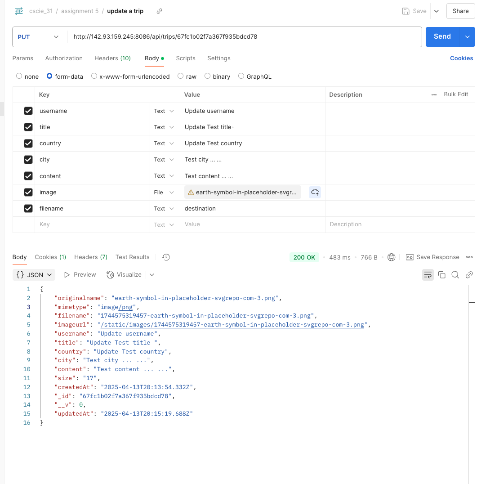

#### Assignment #5 - REST APIs

- Client-side test file ?
visited http://localhost:8086/static/index.html
   

- Keep week4 assignment HTML Interface (by using the /routes/trips.js)
visit http://localhost:8086/trips 
 

---

**GET method in Postman**
URL: http://localhost:8086/api/trips

**GET single trip in Postman**
URL: http://localhost:8086/api/trips/${trip_id}

**POST method In Postman**
URL: http://localhost:8086/api/trips
- Select 'form-data' in Body
- add keys
    - username (text)
    - title (text)
    - country (text)
    - city (text)
    - content (text)
    - image (File)
    - filename (text)
- add value as text and upload the imageFile from your local computer

 

**PUT method In Postman**
URL: http://localhost:8086/api/trips/${trip_id}
- Select 'form-data' in Body
- add keys
    - username (text)
    - title (text)
    - country (text)
    - city (text)
    - content (text)
    - image (File)
    - filename (text)
- add value as text and upload the imageFile from your local computer
 

**Delete method in Postman**
URL: http://localhost:8086/api/trips/${trip_id}