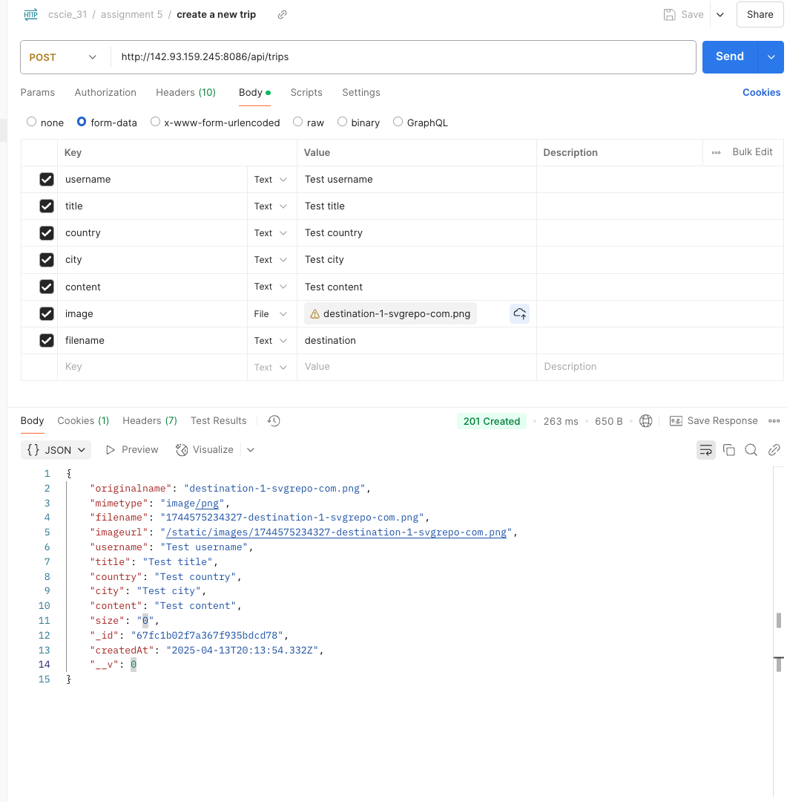

#### Assignment #5 - REST APIs

- After execute POST/PUT request in Postman to create or update a trip, visit http://localhost:8086/trips in the browser to see the new trip or the updated trip.
 

---

**POST method In Postman**
- Select 'form-data' in Body
- add keys
    - username (text)
    - title (text)
    - country (text)
    - city (text)
    - content (text)
    - image (File)
    - filename (text)
- add value as text and upload the imageFile from your local computer

 

